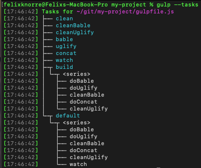

# Docker Image with gulp

This is a Docker Image with [gulp](https://gulpjs.com). The Image will transform, minify and concatenat your js files. 

## Usage

Copy the `docker-compose.yml`-file into your project and run the following command. This will spin a container with gulp und run the watch task. 
Your project must not have a `package.json`. If thats the case, remove the copy command from the Dockerfile and add the packages to your `package.json`.

```bash
docker-compose up -d
```
or

```bash
docker run gulp
docker exec -it <container> ./setupAndRunGulp.sh
```

The `gulpfile.js` fits to a cakephp project. If you want to customize the `gulpfile.js` according to their requests, you have to rebuild the image and change the image in the `docker-compose.yml`.

```bash
docker build --tag gulp:latest .
docker tag gulp:latest fknorre/gulp:latest
```

## packages

* [gulp](https://www.npmjs.com/package/gulp)
* [gulp-babel](https://www.npmjs.com/package/gulp-babel)
* [gulp-uglify](https://www.npmjs.com/package/gulp-uglify)
* [gulp-concat](https://www.npmjs.com/package/gulp-concat)
* [gulp-rename](https://www.npmjs.com/package/gulp-rename)
* [@babel/core](https://www.npmjs.com/package/@babel/core)
* [@babel/preset-env](https://www.npmjs.com/package/@babel/preset-env)
* [del](https://www.npmjs.com/package/del)

## gulp tasks

A list with all tasks that are defined in the `gulpfile.js`.

